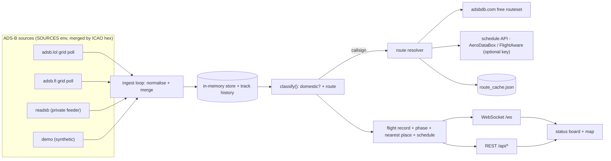

# India Flight Status

A live status board for domestic flights over India, built on public ADS-B data. Each
tracked flight is shown with its phase, route, altitude and speed; with an optional
schedule-API key it also carries scheduled and estimated times, gate and delay.

**Stack:** Python, FastAPI, SQLite, WebSockets; vanilla JavaScript with MapLibre GL on
the front end. No build step and no required API keys.

<!-- Add a screenshot at docs/board.png and a live demo URL here once deployed. -->
<!-- [](https://github.com/<owner>/india-flight-status/actions/workflows/ci.yml) -->

## Features

- **Status board** - one row per live domestic flight: flight number, airline, aircraft
  type, a phase badge (On ground / Departed / En route / On approach), origin and
  destination, and a status line such as *"descending through 1,875 ft, 34 km ESE of
  Mumbai"*. Filter by flight, airline, airport or phase; sort; expand a row for detail.
- **Live map** - aircraft as heading-aligned silhouettes coloured by altitude, with
  dead-reckoned motion between updates and a trail for the selected flight.
- **Historical playback** - a scrubber over persisted position history; replay any
  period at 60-900x.
- **Flight lookup** - `GET /api/status/{ident}` resolves a flight by IATA or ICAO flight
  number, registration or ICAO hex, even when it is filtered off the board.
- **Operational endpoints** - Prometheus metrics at `/metrics`, resolver statistics at
  `/api/health`.

## Architecture



Design rationale and trade-offs are recorded in [`docs/DECISIONS.md`](docs/DECISIONS.md).

## Implementation notes

- **Resilient ingestion.** Public ADS-B endpoints are polled over a shuffled 12-point
  grid at roughly one request every three seconds. Rate-limited cells are skipped rather
  than retried, aircraft are retained across sweeps for `STALE_TTL` seconds, and
  multiple sources are merged and deduplicated by ICAO 24-bit address.
- **Two-stage route resolution.** Origin and destination come first from the free adsbdb
  routeset; an optional keyed schedule API (AeroDataBox or FlightAware) is queried only
  for the remaining gaps, behind an hourly and daily quota guard and an on-disk cache
  that survives restarts. Without a key the board still runs, showing route but no
  scheduled times.
- **Domain-aware classification.** A flight counts as domestic only when both endpoints
  are Indian airports, which also excludes international flights operated by Indian
  carriers. This follows India's cabotage rule: domestic point-to-point service is
  reserved for Indian-AOC operators.
- **Smooth motion from a slow feed.** The client advances each aircraft along its track
  at ground speed at 20 fps and eases into each WebSocket update, so ~25 s server sweeps
  still render as continuous movement.
- **Extensible by design.** A new ADS-B source is one `GridPollSource` subclass; a new
  schedule provider is one class implementing `route(flight_no, callsign)`.

## Getting started

### Local

```bash
cd backend
python -m venv .venv
source .venv/bin/activate          # Windows: .venv\Scripts\activate
pip install -r requirements.txt
cp .env.example .env               # optional
uvicorn app.main:app --reload
```

Served at <http://localhost:8000>. Set `SOURCES=demo` in `.env` for a synthetic feed
that needs no network access.

### Docker

```bash
docker compose up --build
```

## Configuration

Set in `backend/.env`; see [`.env.example`](backend/.env.example) for the full list.

| Variable | Default | Purpose |
|---|---|---|
| `SOURCES` | `adsblol,adsbfi` | Comma-separated ingest sources, merged: `adsblol`, `adsbfi`, `demo`, `readsb:<url>` |
| `POLL_INTERVAL` | `5` | WebSocket push interval (seconds) |
| `STALE_TTL` | `150` | Drop an aircraft after this many seconds unseen |
| `PERSIST` / `DB_PATH` | `true` / `flights.db` | SQLite position history |
| `SCHEDULE_PROVIDER` | _(none)_ | `aerodatabox` or `flightaware`; requires `SCHEDULE_API_KEY` |
| `SCHEDULE_ALL` | `false` | Query the schedule API for every flight, not only unresolved ones |
| `SCHEDULE_MAX_PER_HOUR` / `_PER_DAY` | `30` / `300` | Hard quota caps; calls pause when reached |

## API

| Endpoint | Description |
|---|---|
| `GET /api/flights` | Current domestic flights with route, phase and schedule |
| `GET /api/flights/{hex}` | One flight with its position trail |
| `GET /api/status/{ident}` | Live status by flight number, registration or hex |
| `GET /api/history/span` &middot; `GET /api/history?at=` | Playback data range and a snapshot at time `at` |
| `GET /api/airports` &middot; `/api/airlines` &middot; `/api/stats` | Reference data and breakdowns |
| `GET /api/health` | Counts, active sources, resolver statistics |
| `GET /metrics` | Prometheus metrics |
| `WS /ws` | Pushes the full domestic list every poll |

Interactive OpenAPI schema at `/docs`.

## Tests and CI

```bash
pip install -r backend/requirements-dev.txt
pytest -q
ruff check backend/
black --check backend/app backend/tests
```

47 unit tests cover the classification, route-inference and provider-parsing logic.
CI ([`.github/workflows/ci.yml`](.github/workflows/ci.yml)) runs linting, formatting,
tests and a Docker build on every push and pull request.

## Deployment

- **Fly.io** - `fly launch --copy-config --no-deploy`, then `fly deploy`
  ([`fly.toml`](fly.toml), region `bom`). Set the schedule key with
  `fly secrets set SCHEDULE_API_KEY=...`.
- **Render** - create a new Blueprint from this repository
  ([`render.yaml`](render.yaml)).

## Limitations

- Public feeds surface roughly 90-130 domestic flights against a real peak of 350+.
  Full coverage requires a private `readsb` feeder or a paid aggregator.
- Scheduled times, gate and delay require a keyed schedule provider.
- Track-history origin inference needs a feed that captures departures and is inactive
  on the public feed.

## License

MIT - see [LICENSE](LICENSE). ADS-B data is used under each provider's community terms;
military and state aircraft positions are not published.
