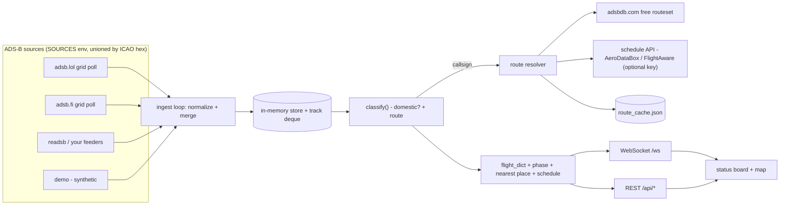

# India Flight Status

Live status board for **domestic** flights over India — every tracked flight with its
phase, route, altitude, speed, and (with a schedule key) scheduled times, gate and
delay. Built on public ADS‑B data, no vendor lock‑in.

> **Live demo:** _add your deploy URL here_ · **Stack:** FastAPI · vanilla JS + MapLibre GL · SQLite

<!-- add a screenshot at docs/board.png and uncomment -->
<!--  -->

---

## What it does

- **Status board** (default view) — one row per live domestic flight: flight number,
  airline, aircraft, phase badge (*On ground / Departed / En route / On approach*),
  route, and a live line like *“descending through 1,875 ft · 34 km ESE of Mumbai”*.
  Filter by flight/airline/airport/status; sort; click a row for full detail.
- **Live map** — MapLibre GL, aircraft as heading‑rotated silhouettes coloured by
  altitude, smooth **dead‑reckoned motion** between updates, selected‑flight trail.
- **Flight lookup** — `GET /api/status/{6E2416 | IGO2416 | VT‑IPZ | hex}` returns a
  flight’s live status even if it’s filtered off the board.

## Architecture



## Engineering highlights

- **Rate‑limit‑resilient ingest.** The free public feed (`adsb.lol`) 429s about half
  of a 12‑point grid sweep. Sources are polled in shuffled order at ~1 req/3 s, a
  starved cell is skipped (not retried into the wall), and `STALE_TTL` retains
  aircraft across sweeps so the map stays populated. Multiple sources are *unioned*,
  deduped by ICAO 24‑bit address.
- **Graceful degradation, zero required keys.** adsbdb (free) resolves most routes;
  a keyed schedule API is an optional second stage tried only for the gaps, behind a
  per‑hour/per‑day quota guard, with an on‑disk cache so restarts don’t re‑spend
  quota. No key → the app still runs, just without scheduled times.
- **Two‑stage route resolution + a domain rule.** A known route is authoritative:
  a flight is “domestic” only if *both* endpoints are in India — which also correctly
  drops international flights Indian carriers operate (e.g. `AI` BOM–HND), leaning on
  India’s cabotage rule (domestic point‑to‑point is reserved for Indian‑AOC carriers).
- **Smooth motion from a slow feed.** The frontend dead‑reckons each aircraft from its
  last report along its track at ground speed (20 fps), easing into each WebSocket
  update — so ~35 s server sweeps still look live.
- **Sandbox‑proof rendering.** Planes are DOM markers and the trail is a `<canvas>`
  overlay projected via `map.project`, so nothing depends on MapLibre’s vector worker;
  init never blocks on basemap tiles loading.
- **Pluggable everything.** New ADS‑B source = one subclass of `GridPollSource`; new
  schedule provider = one class implementing `route(flight_no, callsign)`.

## Run it

### Local (Python)

```bash
cd backend
python -m venv .venv && .venv\Scripts\activate      # macOS/Linux: source .venv/bin/activate
pip install -r requirements.txt
copy .env.example .env                                # optional; defaults are fine
uvicorn app.main:app --reload
```

Open <http://localhost:8000>. Out of the box `SOURCES=adsblol,adsbfi`; set
`SOURCES=demo` for an offline synthetic feed.

### Docker

```bash
docker compose up --build
```

### Deploy

- **Fly.io** — `fly launch --copy-config --no-deploy` then `fly deploy` (config in
  [`fly.toml`](fly.toml), region `bom`). Schedule key: `fly secrets set SCHEDULE_API_KEY=…`.
- **Render** — New → Blueprint → this repo ([`render.yaml`](render.yaml)).

## Configuration (`backend/.env`)

| Var | Default | Notes |
|---|---|---|
| `SOURCES` | `adsblol,adsbfi` | comma list, unioned: `adsblol` · `adsbfi` · `demo` · `readsb:<url>` |
| `POLL_INTERVAL` | `5` | WebSocket push cadence (s); adsblol self‑paces its sweep |
| `STALE_TTL` | `150` | drop an aircraft after this many s unseen |
| `PERSIST` / `DB_PATH` | `true` / `flights.db` | SQLite position history |
| `SCHEDULE_PROVIDER` | — | `aerodatabox` or `flightaware` (needs `SCHEDULE_API_KEY`) |
| `SCHEDULE_ALL` | `false` | `true` → query the schedule API for *every* flight (times/gate/delay for all) — watch your quota |
| `SCHEDULE_MAX_PER_HOUR` / `_PER_DAY` | `30` / `300` | hard caps; calls pause when hit |

## How “domestic” + routes are decided

`backend/app/domestic.py` → `classify()`:

1. Callsign must belong to a known Indian scheduled operator (`data/airlines_in.json`).
2. If a route is known (adsbdb or the schedule API), it’s authoritative — domestic
   iff both endpoints are Indian airports.
3. Otherwise: inside the India bbox, not near a reachable foreign airport
   (KTM/CMB/DAC/…); origin/destination inferred from a watched climb‑out, a current
   descent, or the metro the heading points at (`route_src: "inferred"`).

Flights with no resolvable route are hidden from the board but still reachable via
`/api/status/{number}`.

## API

| Endpoint | Purpose |
|---|---|
| `GET /api/health` | counts, active sources, route‑resolver stats |
| `GET /api/flights` | all current domestic flights (`dep`/`arr`/`phase`/`schedule`) |
| `GET /api/flights/{hex}` | one flight + position trail |
| `GET /api/status/{q}` | live status by flight no / registration / hex |
| `GET /api/airports` · `GET /api/airlines` · `GET /api/stats` | bundled data / breakdown |
| `WS /ws` | pushes the full domestic list every poll |

## Testing

```bash
pip install -r backend/requirements-dev.txt
pytest -q            # 43 tests on the pure logic
ruff check backend/ && black --check backend/app backend/tests
```

CI ([`.github/workflows/ci.yml`](.github/workflows/ci.yml)) runs lint + format + tests
+ a Docker build on every push/PR.

## Limitations

- The free public feed surfaces only ~90–130 domestic flights (real peak traffic is
  ~350+). Only your own `readsb:` feeders or a paid aggregator lift that ceiling.
- adsb.fi has near‑zero India coverage today; it’s wired in for when that changes.
- Track‑history origin inference needs a feed that catches departures — it’s dormant
  on the public feed, active with feeders.
- Scheduled times need a keyed provider; without one the board shows route only.

## Roadmap

- Airport pages (live arrival/departure boards per Indian airport)
- Historical playback from the SQLite track store
- Alerts (“VT‑XXX just departed BLR”)
- Postgres + PostGIS + TimescaleDB option for real history
- Explicit filter/label for state aircraft (IAF/BSF/VIP)

## Notes

- Respect each source’s terms (adsb.lol / adsb.fi are community, non‑abusive use).
- Do not publish military or state aircraft positions.
- Times are UTC internally, shown in IST in the UI.
